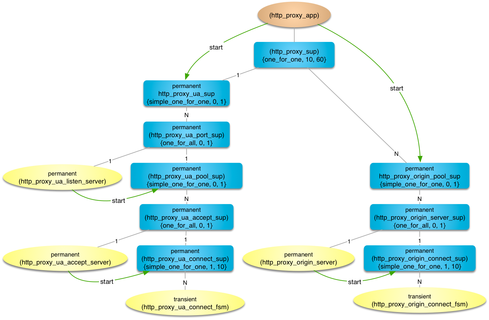
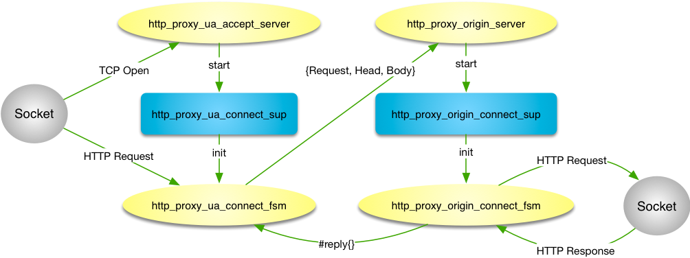

# Description
This project implements a basic HTTP proxy, forwarding requests from
clients to origin servers.  At the moment caching is not implemented.

## Porting
	./configure [--enable-debug]

## Building
	make

## Testing
	make check

## Installing
	make install

## Using

### Instantiate a service
	1> {ok, HttpProxyService} = http_proxy:start(3128, []).
	{ok,<0.51.0>}
### Terminate a running service
	2> http_proxy:close(HttpProxyService).
	ok

## Documentation
HTML documentation will be generated by edoc during build.

## Design
Multiple proxy services may be run with each having a process listening
on the socket and a pool of accept servers.  Each incoming TCP connection 
from a user agent (UA) spawns a finite state machine (FSM) process which
forwards HTTP requests to a process in the origin server pool selected
through pg2.  An FSM is spawned for the connection to the origin server. 

### Supervision Heirarchy

### Messaging
An accept server handles opening a TCP connection from a UA and hands the
socket off to the UA connect FSM.  The UA connect FSM reads the HTTP
request from the socket and sends it to an origin server process which
passes it as an argument to a newly spanwed origin connect FSM process.
The origin connect FSM process opens a socket and sends the request to
the actual origin server. A reply is sent directly to the UA connect FSM
which sends it to the socket of the UA connection.

## License
Everything here is distributed under the Apache License v2.0.

